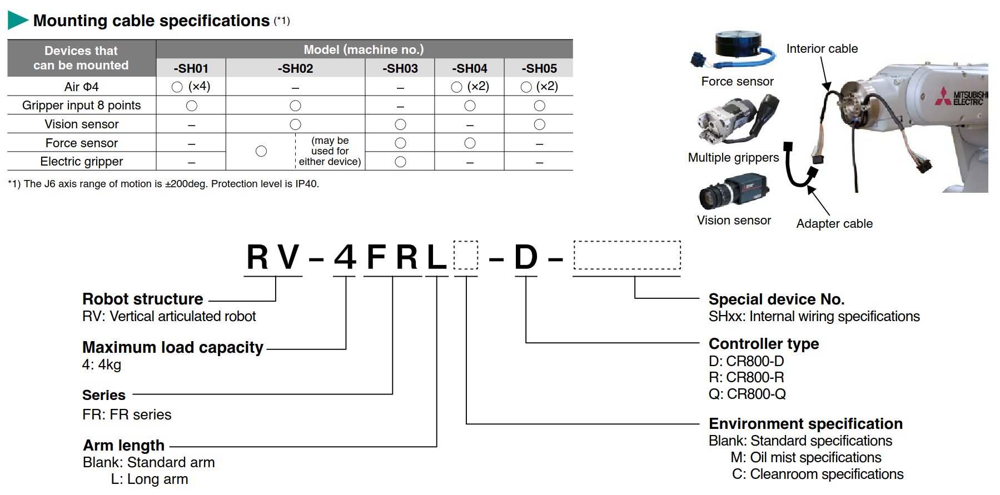
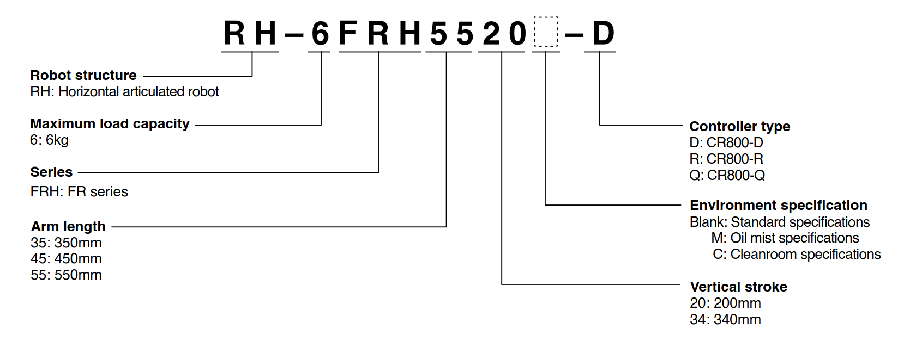

 

# __MITSUBISHI ELECTRIC INDUSTRIAL ROBOT MELFA ROS2 DRIVER__
    
## __1. Overview__

MELFA ROS2 Driver, co-developed with [ROS-Industrial Consortium Asia Pacific](https://rosindustrial.org/ric-apac), provides a suite of tools to enable the creation of advance solutions using our industry proven platform. Mitsubishi Electric provides a ROS2 driver, ROS2 io controllers, robot description files and moveit_config packages of each robot; optimized in-house by our developers to ensure high performance. 

Introducing the next generation of intelligent robots, incorporating advanced solutions technology and “e-F@ctory”, technologies and concepts developed and proven using Mitsubishi Electric’s own production facilities that go beyond basic robotic performance to find ways of reducing the TCO in everything from planning and design through to operation and maintenance. 
 

- [Learn more](https://www.mitsubishielectric.com/fa/products/rbt/robot/index.html)
- [Robot catalog](https://www.mitsubishielectric.com/app/fa/download/search.do?kisyu=/robot&mode=catalog)

 

## __2. MELFA ROS2 Driver Feature__

MELFA ROS2 Driver consists of six main components: melfa_bringup, melfa_description, melfa_driver, melfa_io_controllers, melfa_msgs, various moveit_config packages.

### __melfa_bringup__

- provides launch files for robot bringup

### __melfa_description__

- contains robot descriptions
- ros2_controllers

### __melfa_driver__

- supports [ros2_control](https://control.ros.org/humble/doc/getting_started/getting_started.html).
- provides __real time communication__1 hardware interface with our CR800-R/Q/D robot controllers via __rtexc api__ 2 from our [__MELFA ethernet SDK__](https://github.com/Mitsubishi-Electric-Asia/melfa_ethernet_sdk/tree/main). 
- connects to the robot controller via __rtexc api__ to control the robot via __MELFA BASIC VI__3 __MXT__4 command. The robot position command, robot state & I/O data are transmitted through this connection. 
- includes quality of life features built into __rtexc api__ such as user configurable disconnection detection and debugging tools.

### __melfa_io_controllers__

- supports [ros2_control](https://control.ros.org/humble/doc/getting_started/getting_started.html).
- user configurable io controllers.
- provides ROS2 controllers for GPIO control

### __melfa_msgs__

- provides ROS2 msgs for MELFA robots

### __melfa_robot-model_moveit_config__

- provides example MoveIt config and launch files for MELFA robots
- supports OMPL, Pilz Industrial Planner, CHOMP and Moveit servo.
- optimized by our developers to ensure high performance in speed and accuracy.

<table>
<head>
</head>
    <tr>
        <th colspan="1">Tier 1 Supported Robots</th>
        <th colspan="3">Robot Controllers</th>
    </tr>
    <tr>
        <th>Robot Model</th>
        <th>CR800-R</th>
        <th>CR800-Q</th>
        <th>CR800-D</th>
    </tr>
    <tr>
        <td>RH-6FRH5520</td>
        <td>&#9711;</td>
        <td>&#9711;</td>
        <td>&#9711;</td>
    </tr>
    <tr>
        <td>RH-6CRH6020</td>
        <td>&#10005;</td>
        <td>&#10005;</td>
        <td>&#9711;</td>
    </tr>
    <tr>
        <td>RV-2FR</td>
        <td>&#9711;</td>
        <td>&#9711;</td>
        <td>&#9711;</td>
    </tr>
    <tr>
        <td>RV-4FR</td>
        <td>&#9711;</td>
        <td>&#9711;</td>
        <td>&#9711;</td>
    </tr>
    <tr>
        <td>RV-4FRL</td>
        <td>&#9711;</td>
        <td>&#9711;</td>
        <td>&#9711;</td>
    </tr>
    <tr>
        <td>RV-5AS</td>
        <td>&#10005;</td>
        <td>&#10005;</td>
        <td>&#9711;</td>
    </tr>
    <tr>
        <td>RV-7FRL</td>
        <td>&#9711;</td>
        <td>&#9711;</td>
        <td>&#9711;</td>
    </tr>
    <tr>
        <td>RV-8CRL</td>
        <td>&#10005;</td>
        <td>&#10005;</td>
        <td>&#9711;</td>
    </tr>
    <tr>
        <td>RV-13FRL</td>
        <td>&#9711;</td>
        <td>&#9711;</td>
        <td>&#9711;</td>
    </tr>
</table>

&#10146; 1  __real time communication__ frequency is 286Hz for CR800-R & CR-800-D and 141Hz for CR800-Q.

&#10146; 2  __rtexc api__ stands for Real Time External Control API.

&#10146; 3  __MELFA BASIC VI__ is our proprietary robot programming language.

&#10146; 4  __MXT__ is the command to enable __real time external control__.

>Note1: You can download the [Ethernet Function Instruction Manual](https://www.mitsubishielectric.co.jp/fa/download/search.do?mode=manual&kisyu=/robot&q=Ethernet%20Function%20Instruction%20Manual&sort=0&style=0&lang=2&category1=0&filter_readme=0&filter_discontinued=0&filter_bundled=0) from [Robot Industrial/Collaborative Robot MELFA Manual](https://www.mitsubishielectric.co.jp/fa/download/search.do?mode=manual&kisyu=/robot). 

## __3. MELFA ROS2 Driver Usage and Installation__

MELFA ROS2 Driver is designed to interface CR800 robot controllers with the ROS2 so that developers can leverage the contributions from the Open Source Community with an industry proven robot platform.
 

&#10148; If your ROS PC is installed with ROS 2 Humble Hawksbill, see [MELFA ROS2 Driver-humble](https://github.com/Mitsubishi-Electric-Asia/melfa_ros2_driver/tree/humble) and follow the user guide. 

- [MELFA ROS2 user guide](./doc/melfa_ros2_driver.md) : Usage and Installation of MELFA ROS2.
- [RT Toolbox3 Setup](./doc/rt_toolbox3_setup.md) : Create your first RT Toolbox3 Project File for ROS2.
- [RT Toolbox3 Simulator Setup](./doc/rt_sim_setup.md) : Connect to RT Toolbox3 simulator as if it is a real robot.
- [RT Toolbox3 Real Robot Setup](./doc/rt_real_setup.md): Connect to a MELFA robot.

  

 

## __4. Other MELFA ROS2 Related Repositories__

- [MELFA ROS2 8XS](https://github.com/Mitsubishi-Electric-Asia/melfa_ros2_8xs/tree/humble) : Sample package with MELSERVO integration for 6+2-axis articulated robot and 4+2-axis SCARA robot. Accompanied with RT Toolbox3 Project File to try in RT Toolbox3 simulator.
- [MELFA ROS2 Masterclass 2024](https://github.com/Mitsubishi-Electric-Asia/melfa_ros2_masterclass_2024/tree/humble) : Masterclass repository for ROS-Industrial Asia Pacific Summit 2024: Empowering Innovations with MELSOFT Simulators. 
- [MELFA ROS2 PLC](https://github.com/Mitsubishi-Electric-Asia/melfa_ros2_plc/tree/humble) : Sample program with simple integration for MELSEC iQ-R Controllers.
- [MELFA ROS2 HMI](https://github.com/Mitsubishi-Electric-Asia/melfa_ros2_hmi/tree/humble) : Sample program with simple integration with GOT-HMI (Human Machine Interface) for iQ-platform robot controllers.

 

## __5. MELFA Naming Convention__

This section provides a brief introduction to naming conventions of MELFA robots. Below are images from our [robot catalog](https://www.mitsubishielectric.com/app/fa/download/search.do?kisyu=/robot&mode=catalog) describing the naming convention.

For articulated robots (RV), it is fairly straightforward as the variations that contribute to package differences are __Maximum load capacity__, __Series__ and __Arm length__. 

 

 

For SCARA robots (RH), it has more variations that contribute to packages differences such as __Maximum load capacity__, __Series__, __Arm length__ in cm and __Vertical stroke__ in cm.

 

 

__Environment specifications__, __Internal wiring__ and __Controller type__ do not contribute to kinematic variations. However, it is important to take note of __Controller type__ as it may change the __Control frequency__ and/or __I/O controller__ settings.

## __6. Contact us / Technical support__
More Support & Service, please contact us [@MEAP](https://sg.mitsubishielectric.com/fa/en/contact.html) &#9743;. For contributing and reporting, refer to [this](./CONTRIBUTING.md) for development related enquiries.

 

