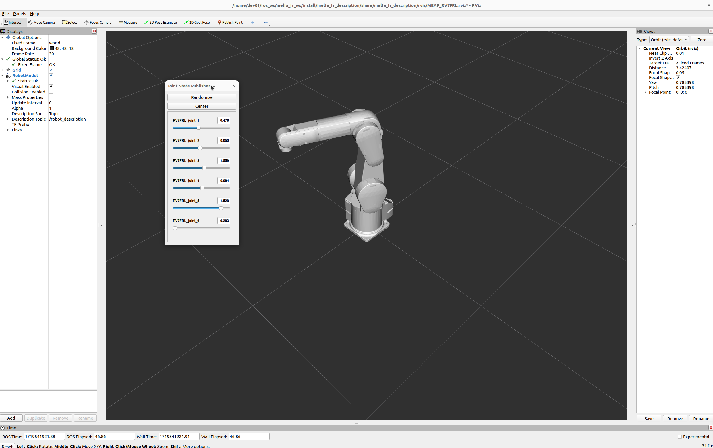
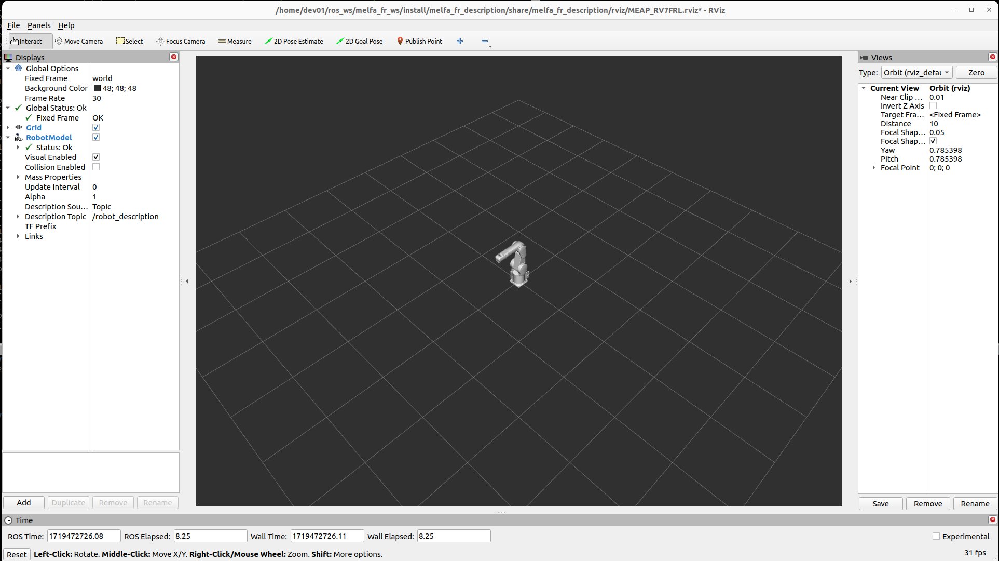
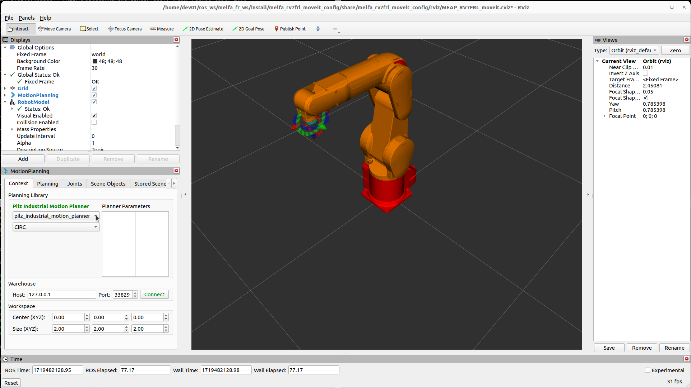
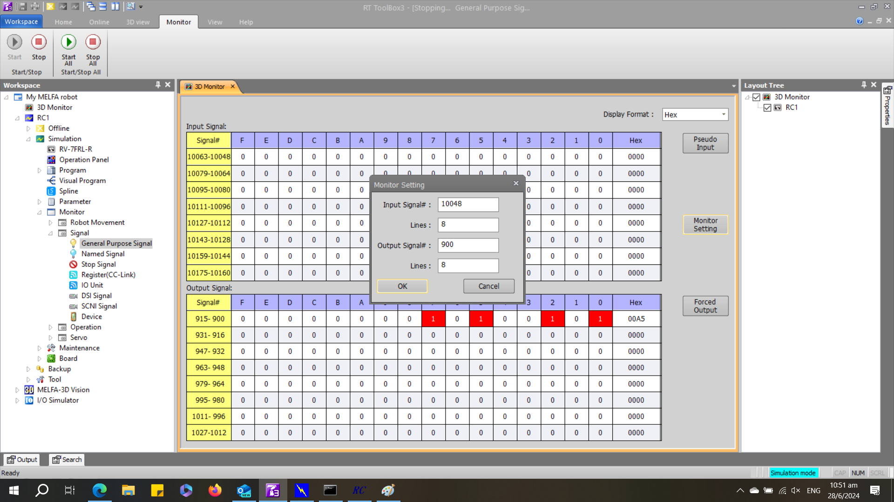
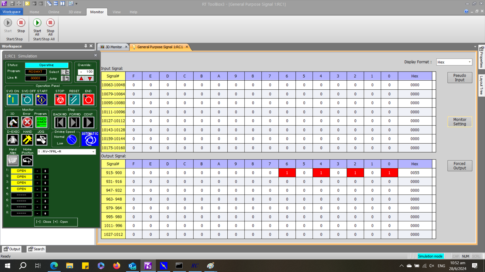
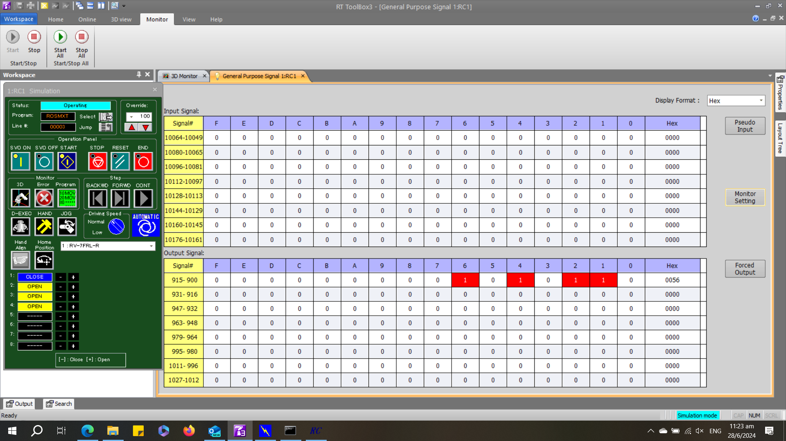
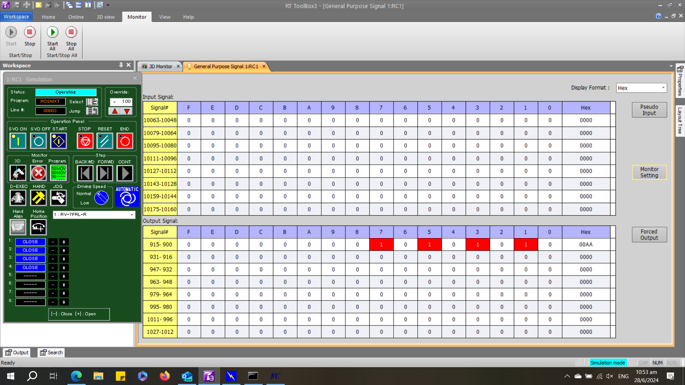
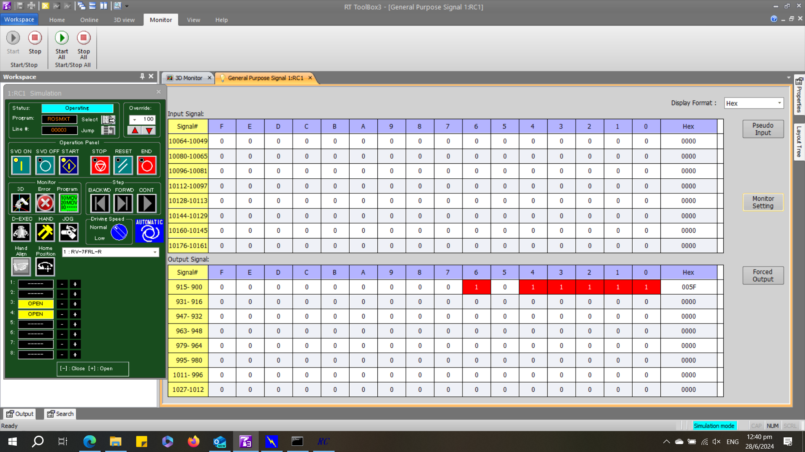

 


# __MELFA ROS2 Usage__

MELFA ROS2 is designed to interface the CR800 robot controller with the ROS2 so that program developers and researchers can build and reuse their own programs to control the MELFA externally.

## __1. Installation__

This manual is for <u>__ROS2 Humble__</u> using [__rtexc api version 1.0__](). For more information regarding __rtexc api__ , please refer to [CR750/CR751 Series Controller, CR800 Series Controller Ethernet Function Instruction Manual](https://dl.mitsubishielectric.co.jp/dl/fa/document/empf/manual/robot/bfp-a3379/bfpa3379g.empf) from [Robot Industrial/Collaborative Robot MELFA Manual](https://www.mitsubishielectric.co.jp/fa/download/search.do?mode=manual&kisyu=/robot).

### __Build and Install__

1. Clone or download MELFA ROS2 from the git repository into your working directory.

```
mkdir -p ~/melfa_ws/src
cd ~/melfa_ws/src
git clone -b humble https://github.com/Mitsubishi-Electric-Asia/melfa_ros2_driver.git
source /opt/ros/humble/setup.bash
```

2. Install moveit servo and chomp

```
sudo apt install ros-humble-moveit-chomp-optimizer-adapter
sudo apt install ros-humble-moveit-planners-chomp
sudo apt install ros-humble-chomp-motion-planner
sudo apt install ros-humble-moveit-servo
```

3. Update package dependency sources

```
cd ~/melfa_ws
rosdep update
```

3. Install dependencies

```
cd ~/melfa_ws
rosdep install -r --from-paths . --ignore-src --rosdistro humble -y --skip-keys warehouse_ros_mongo
```

4. Build the packages

```
cd ~/melfa_ws
colcon build --cmake-args -DCMAKE_BUILD_TYPE=Release
```

5. Remember to source the workspace

```
source install/setup.bash
```

## __2. Viewing the robot__

1. To view the robot, run the following command. The command will launch __Joint State Publisher__ for you use.

```
ros2 launch melfa_description view_rv7frl.launch.py 
```

</br>
  

</br>

## __3. Lanching the robot with MoveIt__

1. Launch robot arm in Rviz2 simulation (the controller_type and robot_ip values do not affect simulation outcomes) [Terminal 1]

```
ros2 launch melfa_bringup rv7frl_control.launch.py use_fake_hardware:=true controller_type:=<CONTROLLER TYPE> robot_ip:=<ROBOT IP>
```
#### Or you can try with a [real robot](./rt_real_setup.md) or [RT Toolbox3 simulator](./rt_sim_setup.md). If you have not created your RT Toolbox3 project file, refer to [this guide](./rt_toolbox3_setup.md)
</div>

1. Launch robot arm with real robot or RT Toolbox3 simulator (the controller_type ["R" (or) "Q" (or) "D"] and robot_ip should be aligned with actual robot) [Terminal 1]

```
ros2 launch melfa_bringup rv7frl_control.launch.py use_fake_hardware:=false controller_type:=<CONTROLLER TYPE>  robot_ip:=<ROBOT IP>
```

Eg: Connecting to RT Toolbox3 simulator or real robot.

```
ros2 launch melfa_bringup rv7frl_control.launch.py use_fake_hardware:=false controller_type:="R" robot_ip:=192.168.3.100
```

Eg: Rviz simulation.

```
ros2 launch melfa_bringup rv7frl_control.launch.py use_fake_hardware:=true controller_type:="R"
```

</br>

  

</br>

1. Launch MoveIt. [Terminal 2]

```
ros2 launch melfa_rv7frl_moveit_config rv7frl_moveit.launch.py
```

</br>

  

</br>

## __4. Examples of IO Commands__

This section will guide you through a simple demo of melfa_io_controllers using RT Toolbox3 simulator

### __RT Toolbox3 I/O Monitoring__

1. Expand __Simulation__ &rArr; __Monitor__ &rArr; __Signal__. _Double click_ to open __General Purpose Signal__. On the far right of the window, _select_ __Monitor Setting__. Use the following settings as shown. Input settings do not matter as we will not be using it.

```
Output Signal: 900
Lines: 8
```

</br>

  

</br>

2. Open __Operation Panel__ from the _Workspace_ panel on the left by _double clicking_. _Click_ on __HAND__ to expand the __Operation Panel__ to show hand state.

</br>

  

</br>

You are now ready to try the __I/O Controller Demo__.

### __I/O Controller Demo__

1. Launch real robot arm with controller_type R [Terminal 1]

```
ros2 launch melfa_bringup rv7frl_control.launch.py use_fake_hardware:=false controller_type:="R" robot_ip:=192.168.3.100
```

</br>

  

</br>

2. To view the enabled IO interfaces

```
ros2 topic echo /gpio_controller/io_control_mode
```

</br>

  

</br>

3. To enable desired IO interfaces [Below command lets user to read/write hand_io_interface, plc_link_io_interface, safety_io_interface, io_unit_interface, misc1_io_interface, misc2_io_interface, misc3_io_interface] [Terminal 2]

```
ros2 service call /gpio_controller/configure_mode melfa_msgs/srv/ModeConfigure "{hand_io_interface: true, plc_link_io_interface: true, safety_io_interface: true, io_unit_interface: true, misc1_io_interface: true, misc2_io_interface: true, misc3_io_interface: true}"
```

4. To configure IO, use GPIO configure service [Terminal 2]

```
# Fields Required
uint16 bitid
string mode
uint16 bitdata
uint16 bitmask
---
bool success
```
| Parameter| Description|
| ---      | ---      |
| bitid    | Address of first bit|
| mode     | IO Mode |
| bitdata  | Data to be sent in uint16_t|
| bitmask  | Bit mask for bitdata|

| IO Mode  | Description|
| ---      | ---      |
| READ_OUT | Reads Output Signal|
| READ_IN  | Reads Input Signal |
| WRITE_OUT| Writes Output Signal|


Example 4.1: Writing Hand output value to close Hand port 1:

```
ros2 service call /gpio_controller/configure_gpio melfa_msgs/srv/GpioConfigure "{bitid: 900, mode: "WRITE_OUT", bitdata: 0b10, bitmask: 0b11}"
```

<br>

  

</br>

To observe changes in Hand IO interface [Terminal 3]

```
ros2 topic echo /gpio_controller/hand_io_state
```

Example 4.2 Writing Hand output value to toggle all Hand ports:</br>
Close all hands

```
ros2 service call /gpio_controller/configure_gpio melfa_msgs/srv/GpioConfigure "{bitid: 900, mode: "WRITE_OUT", bitdata: 0b10101010, bitmask: 0xFFFF}"
```

</br>

  

</br>

To observe changes in Hand IO interface [Terminal 3]

```
ros2 topic echo /gpio_controller/hand_io_state
```

Open all hands

```
ros2 service call /gpio_controller/configure_gpio melfa_msgs/srv/GpioConfigure "{bitid: 900, mode: "WRITE_OUT", bitdata: 0b01010101, bitmask: 0xFFFF}"
```

</br>

  

</br>

To observe changes in Hand IO interface [Terminal 3]

```
ros2 topic echo /gpio_controller/hand_io_state
```

Example 4.3: Reading PLC link output value. Output:10048 reflects Output:900. [Note: bitdata and bitmask doesn't affect "READ_OUT" and "READ IN" mode]

```
ros2 service call /gpio_controller/configure_gpio melfa_msgs/srv/GpioConfigure "{bitid: 10048, mode: "READ_OUT", bitdata: 0x0, bitmask: 0x0}"
```

To observe changes in PLC link IO interface [Terminal 4]

```
ros2 topic echo /gpio_controller/plc_link_io_state
```

Example 4.4: To configure using Topic

| IO Mode  | bit_recv_type| bit_send_type| bitmask|
| ---      | ---          |---           |---     |
| READ_OUT | MXT_IO_OUT   |MXT_IO_OUT    |0x0     |
| READ_IN  | MXT_IO_IN    |MXT_IO_NULL   |0x0     |
| WRITE_OUT| MXT_IO_OUT   |MXT_IO_OUT    |0xFFFF  |

```
ros2 topic pub /gpio_controller/gpio_command melfa_msgs/msg/GpioCommand '{bitid: 900, bitmask: 0xF00F, bit_recv_type: "MXT_IO_OUT", bit_send_type: "MXT_IO_OUT", bitdata: 0xFF}'

```

</br>

  

</br>

Example 4.5: To configure IO control mode [Below command lets user read or write only hand_io_interface and safety_io_interface and disables plc_link_io_interface]

```
ros2 service call /gpio_controller/configure_mode melfa_msgs/srv/ModeConfigure "{hand_io_interface: true, plc_link_io_interface: false, safety_io_interface: true, io_unit_interface: true, misc1_io_interface: true, misc2_io_interface: true, misc3_io_interface: true}"

```

Note: The above command disables any read or write operation for the plc_link_io_interface. To enable again, repeat the service call with plc_link_io_interface as "true"

## __5. Trying MoveIt Servo__

Launch robot driver simulation or real robot [Terminal 1]

```
ros2 launch melfa_bringup rv7frl_control.launch.py use_fake_hardware:=false controller_type:="R" robot_ip:=192.168.3.100 launch_servo:=true
```

Launch moveit config [Terminal 2]

```
ros2 launch melfa_rv7frl_moveit_config rv7frl_moveit.launch.py
```

Launch Servo Keyboard Input [Terminal 3]

```
ros2 run melfa_rv7frl_moveit_config servo_keyboard_input
```

### Other guides:
- [Home page](./../README.md)
- [MELFA ROS2 user guide](./melfa_ros2_driver.md) : Usage and Installation of MELFA ROS2.
- [RT Toolbox3 Setup](./rt_toolbox3_setup.md) : Create your first RT Toolbox3 Project File for ROS2.
- [RT Toolbox3 Simulator Setup](./rt_sim_setup.md) : Connect to RT Toolbox3 simulator as if it is a real robot.
- [RT Toolbox3 Real Robot Setup](./rt_real_setup.md): Connect to a MELFA robot.