 

# __Connecting to Real Robot__

This section will guide you on setting up a new robot using a USB cable with ferite core assuming that you do not know the IP address of the robot and ethernet cable assuming that you know the IP address of the robot. This section will use the RT Toolbox3 project that you have configured in Chapter __2. RT Toolbox3 Setup__ and __3. Connecting to RT Toolbox3 Simulator__ as continuation from the previous chapters. It is highly recommended to test your ROS2 application using RT Toolbox3 simulator before testing it on a physical robot.
```
Robot Factory Default IP address: 192.168.0.20
```
Sections:

1. __Connecting via USB Cable__

2. __Connecting via Ethernet Cable__

3. __Setup Real Robot__

4. __Verifying Local IP address on Ubuntu 22.04LTS__

5. __ROS2 Connection to Real Robot__

## __1. Connecting via USB Cable__

This is not the prefered way as it requires a USB cable with ferite core to ensure stable connection with the robot controller. If you know the IP address of the robot, please use the __Connect via Ethernet cable__ guide in the next section.

1. Ensure that RT Toolbox3 is __offline__. _Right click_ __RC1__ to open project options. Select __Edit Project__.

<br/>
  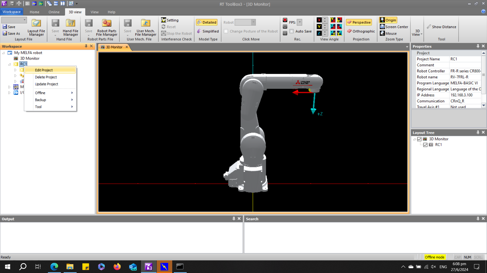

<br/>

2. Select __Communication__ and set __Method:__ as __CRnQ_R__. If you are using a __CR800-D__ robot controller, skip to step #. If not, Select __Detail...__

<br/>
  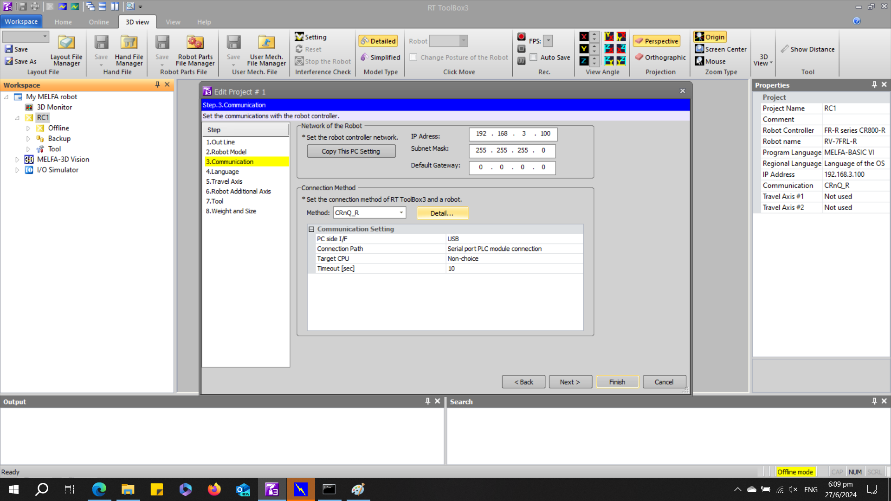

<br/>

3. Select __Detail__

<br/>
  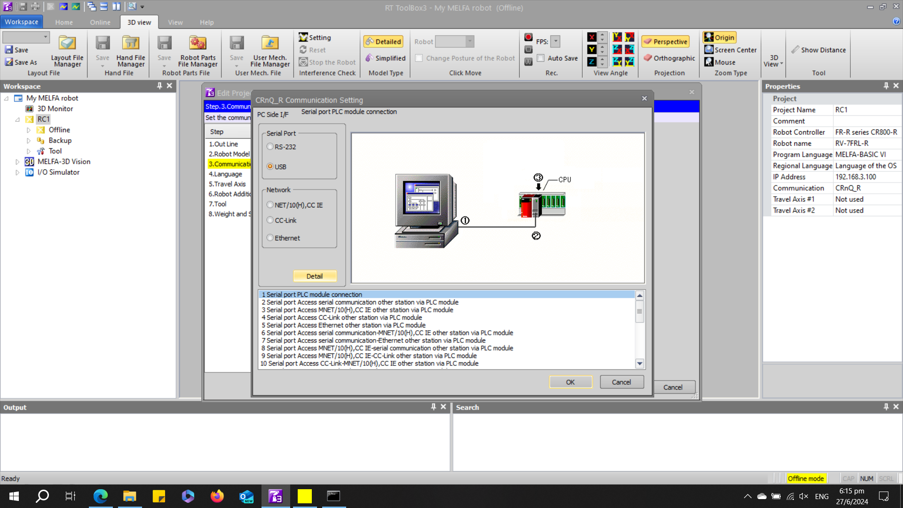

<br/>

4. Select the __Target CPU__. For ths tutorial, my robot CPU is the second CPU on the PLC. Select __OK__.

<br/>
  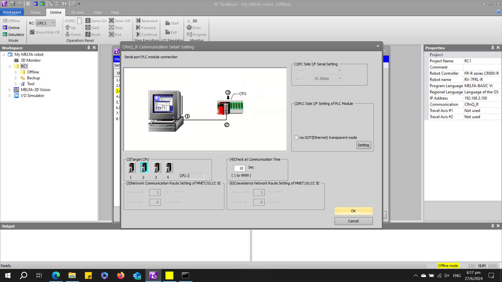

<br/>

5. Select the __Finish__.

<br/>
  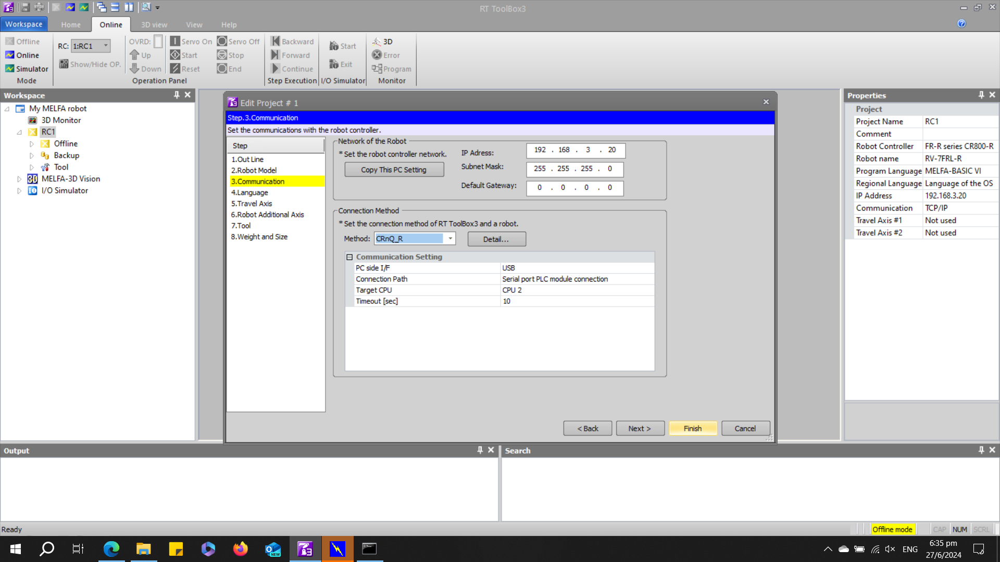

<br/>

6. Select the __Online__.

<br/>
  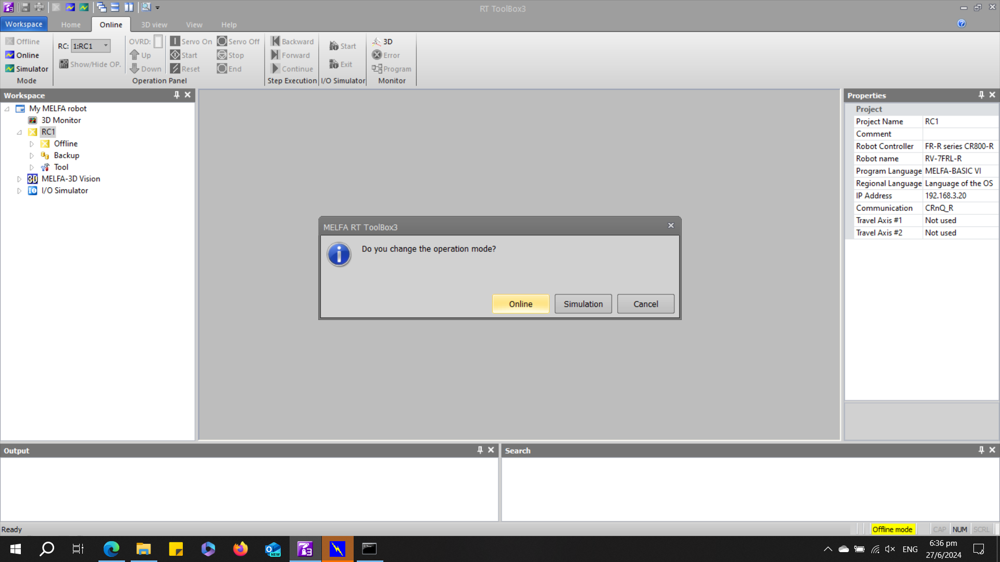

<br/>

7. On the __Workspace__ panel on the left, expand __Online__ &rArr; __Parameter__ &rArr; __Communication Parameter__ &rArr; __Ethernet__. You will find the IP address of your robot in the popup window.

<br/>
  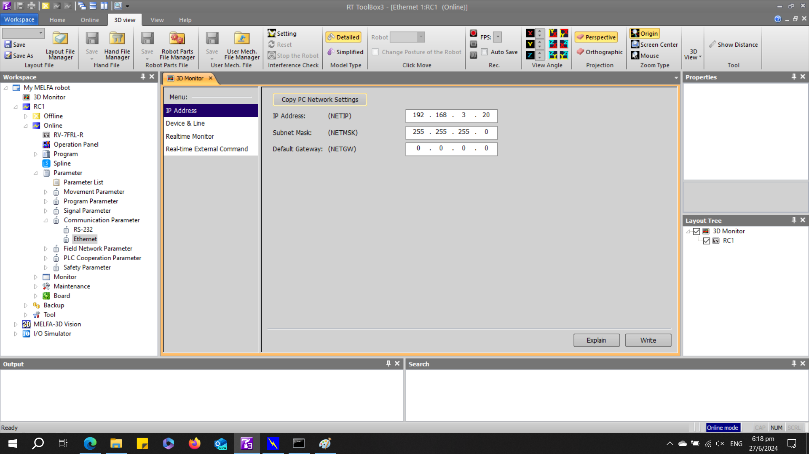

<br/>

## __2. Connecting via Ethernet Cable__


1. Ensure that RT Toolbox3 is __offline__. _Right click_ __RC1__ to open project options. Select __Edit Project__.

<br/>
  

<br/>

2. Select __Communication__ and set __Method:__ as TCP/IP. Select __Finish__.

<br/>
  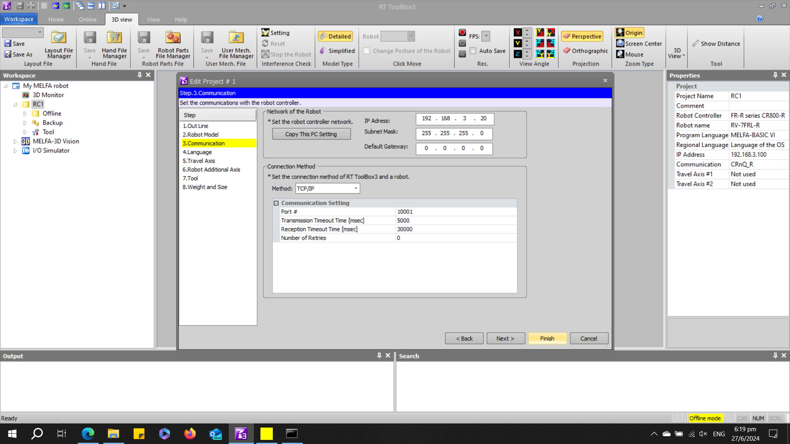

<br/>

3. Select __Online__.

<br/>
  

<br/>

## __3. Setup Real Robot__

1. While connected to the robot, expand __Online__ and _right click_ __Program__. Select __Program Manager__

<br/>
  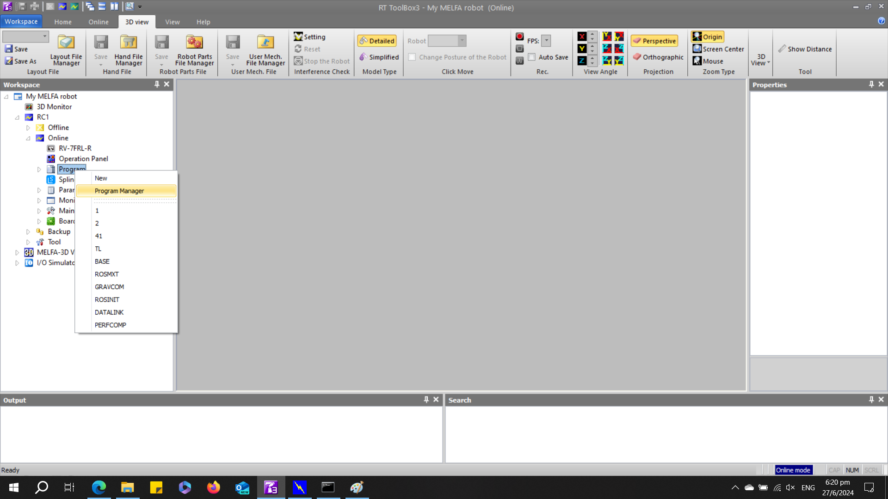

<br/>

2. In the popup window, select the __Source__ as __Project__. This sets the source of the program file as the RT Toolbox3 project file you have created. Select the  __robot program__ using the checkbox. Select __Copy__.

<br/>
  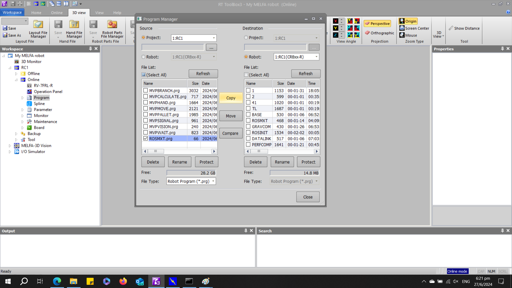

<br/>

3. Select __OK__

<br/>
  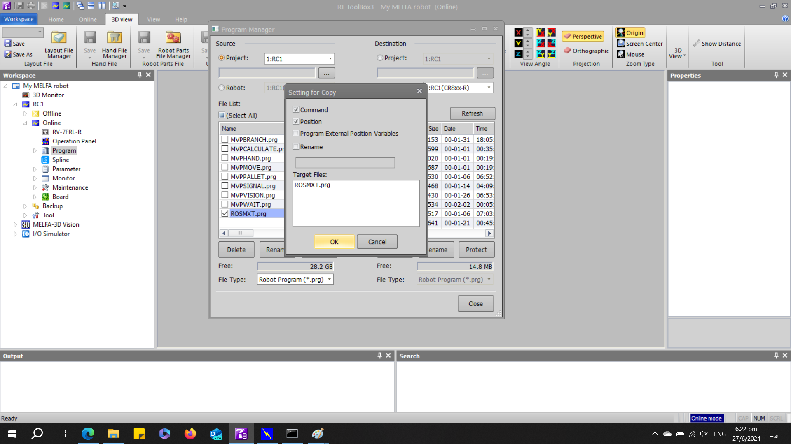

<br/>

4. Expand __Online__ and open __Operation Panel__ by _double clicking_. On the __Operation Panel__ (Blue popup window for real robot), click on the __Select__ button and select the _robot program_ you have created. Click __OK__.

<br/>
  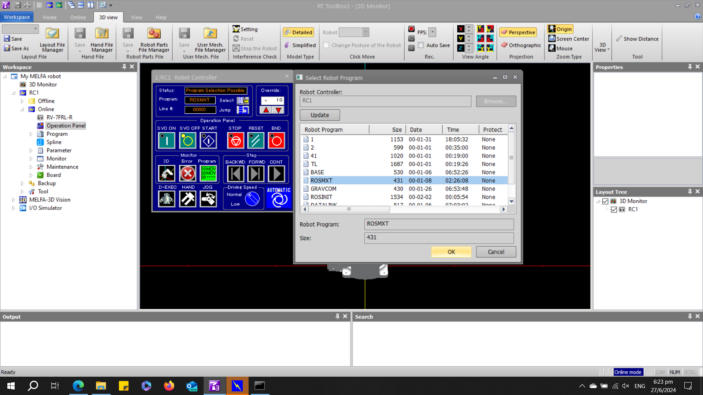

<br/>

5. On the __Operation Panel__ (Blue popup window for real robot), click on the __blue START__ button 

<br/>
  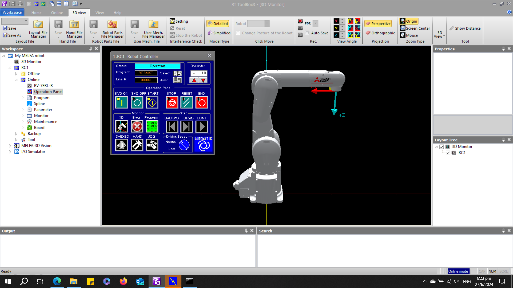

<br/>

## __4. Verifying Local IP address on Ubuntu 22.04LTS__

This section will guide you to find your local IP address on your Ubuntu 22.04LTS device. The process is similar on other Ubuntu versions.

1. Go to __Settings__ &rArr; __Network__ &rArr; __Wired (+)__ to create a new ethernet profile. Under __IPv4 Method__, select __Manual__ and input your preferred IP address for your Linux computer.
<br/>

   

<br/>

2. From your Linux computer, ping the robot's IP addresss. If ping is unsuccessful, verfiy your Linux and RObot IP addresses and try again.

~~~
#ping <Robot local IP address>
ping 192.168.3.20
~~~

## __5. ROS2 Connection to Real Robot__

1. Assuming that ping is successful, you are now ready to connect your robot. For the purpose of this tutorial, run the following command in the terminal. This command will launch the bringup launch file for RV7FRL robot using the CR800-R robot controller.

~~~
ros2 launch melfa_bringup rv7frl_control.launch.py use_fake_hardware:=false controller_type:="R" robot_ip:=192.168.3.100
~~~

 To launch moveit servo use the following command instead

~~~
ros2 launch melfa_bringup rv7frl_control.launch.py use_fake_hardware:=false controller_type:="R" robot_ip:=192.168.3.100 launch_servo:=true
~~~

<br/>

  

<br/>
2. To launch moveit. MELFA ROS2 moveit_config packages are natively compatible with OMPL, Pilz industrial planner, CHOMP and Moveit Servo.

```
ros2 launch melfa_rv7frl_moveit_config rv7frl_moveit.launch.py
```

<br/>

  

<br/>

