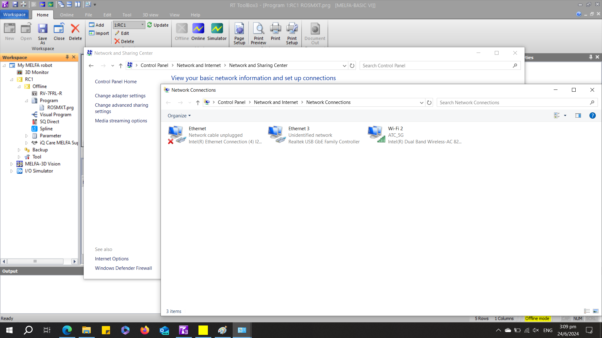
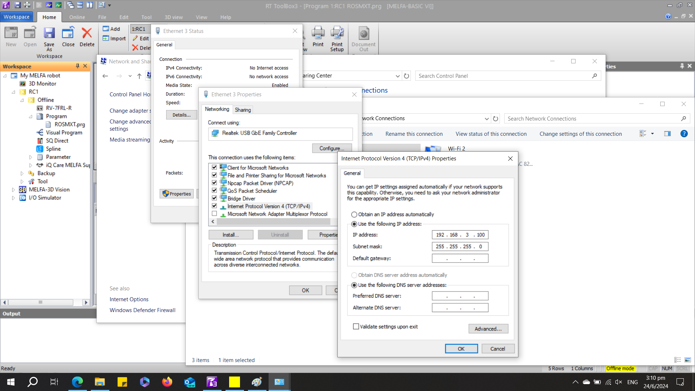
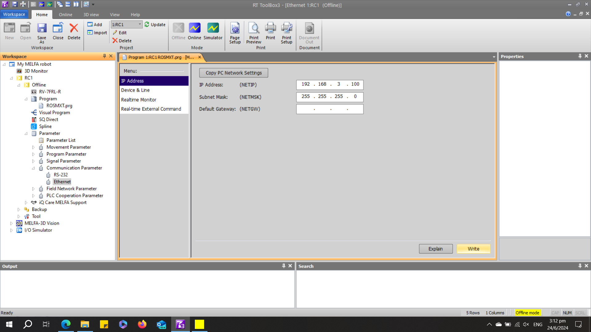
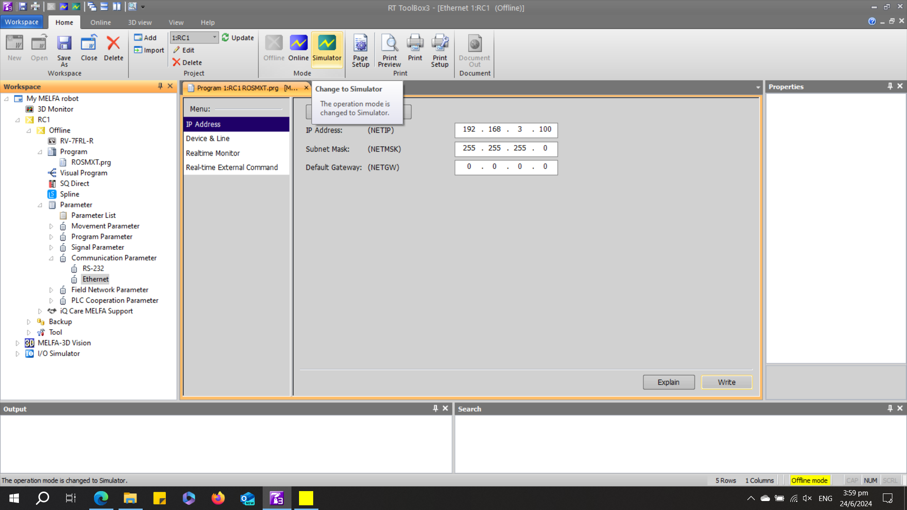
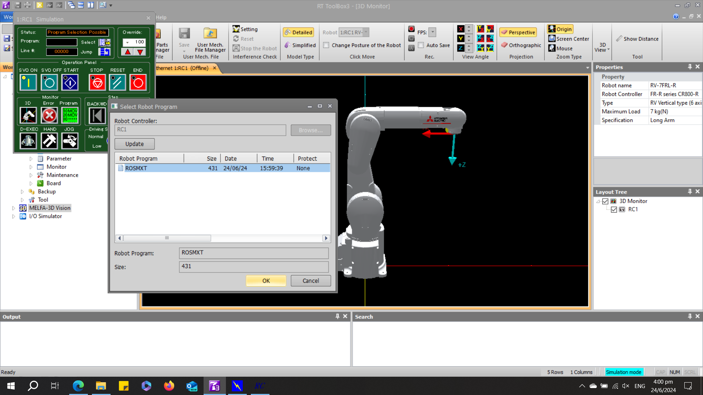
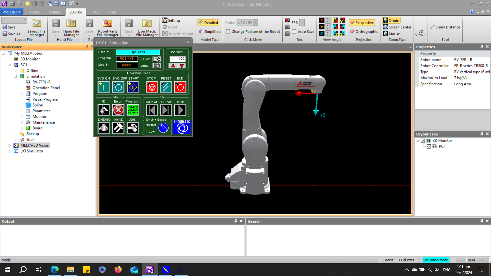
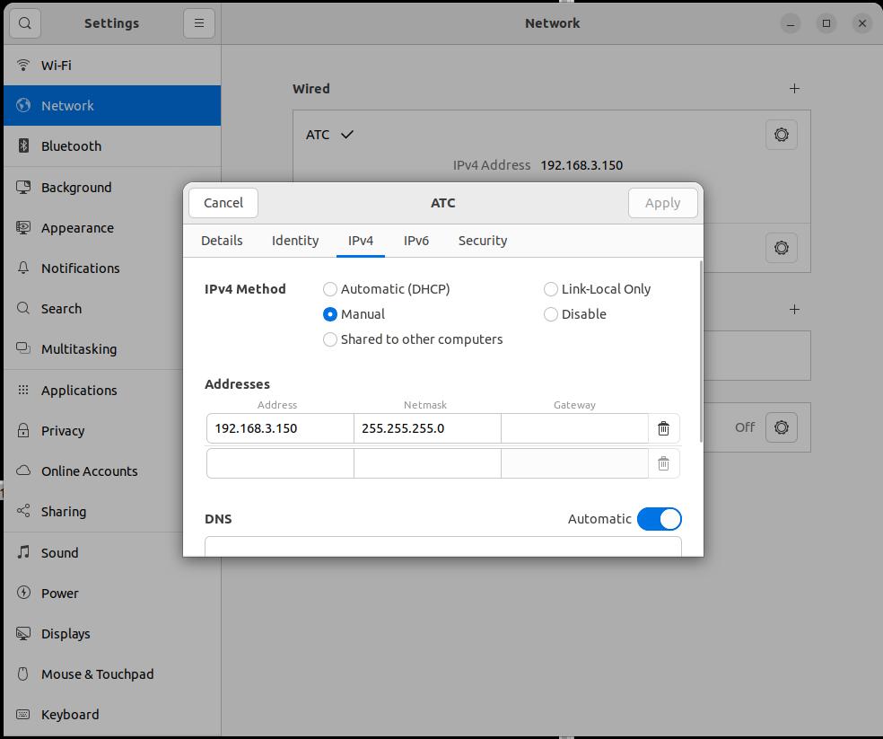

 

# __Connecting to RT Toolbox3 Simulator__

This section will guide you to establish a UDP/IP connection between your ROS2 computer and _RT Toolbox3 simulator_. It is highly recommended to test your ROS2 applications on __RT Toolbox3 simulator__ before testing it on a real robot. This is helpful as __RT Toolbox3 simulator__ provides "near real" experience with 1-to-1 error conditions, velocity profiles and "close to actual" cycle times. _RT Toolbox3 simulator_ works with __Real Time Monitoring__<sup>1</sup> function which is useful for optimizing your ROS2 application.

&#10146; <sup>1</sup> __Real Time Monitoring__ : found in [Ethernet Function Instruction Manual](https://dl.mitsubishielectric.co.jp/dl/fa/document/empf/manual/robot/bfp-a3379/bfpa3379g.empf) from [Robot Industrial/Collaborative Robot MELFA Manual](https://www.mitsubishielectric.co.jp/fa/download/search.do?mode=manual&kisyu=/robot). Provides real time data at control cycle intervals, 3.5ms for CR800-R/D and 7.11ms for CR800-Q.

To connect MELFA ROS2 to _RT Toolbox3 simulator_, your Windows device and _RT Toolbox3 simulator_ must have the same IP address.

Sections:

1. __Verifying Local IP Address on Windows__
2. __Verifying Local IP Address on Ubuntu 22.04LTS__
3. __ROS2 Connection to Simulator__

## __1. Verify Local IP Address on Windows__

This section will guide you to find your local IP address on your Windows10 device.

1. Go to __control panel__ &rArr; __Network and Internet__ &rArr; __Network and Sharing Centre__ and select __Change adapter settings__. Your Network adapters will be displayed in a popup window.

<br/>



<br/>

2. Select your network adapter that you wish to connect to your ROS2 computer. Select __Properties__ &rArr; __Internet Protocol Version 4 (TCP/IPv4)__. In the popup window, you can change your IP to your prefered IP address in your local network. Take note of the IP address you have chosen as you will need to input the same IP address into RT Toolbox3.

<br/>



<br/>

3. Go to the RT Toolbox3 project file that you have setup in the previous tutorial. Select __Parameter__ &rArr; __Communication Parameter__. In the popup window, select __IP Address__. Input your Windows device local IP address as shown below. Select __Write__ at the bottom read corner of the window. Ensure that it is written in.

<br/>



<br/>

4. Select __Simulator__ to launch __RT Toolbox3 simulator__.

<br/>



<br/>

5. On the __Operation Panel__ (Green popup window for simulated robot), click on the __Select__ button and select the _robot Program_ you have created. Click __OK__. 

<br/>



<br/>

6. On the __Operation Panel__ (Green popup window for simulated robot), click on the __blue START__ button 

<br/>
  

<br/>

## __2. Verifying Local IP address on Ubuntu 22.04LTS__

This section will guide you to find your local IP address on your Ubuntu 22.04LTS device. The process is similar on other Ubuntu versions.

1. Go to __Settings__ &rArr; __Network__ &rArr; __Wired (+)__ to create a new ethernet profile. Under __IPv4 Method__, select __Manual__ and input your preferred IP address for your Linux computer.
<br/>

   

<br/>

2. From your Windows computer, ping your Linux computer. You may not be able to ping your Windows computer from your Linux computer due to Windows settings. If ping is unsuccessful, verfiy your Windows and Linux IP addresses and try again.

~~~
#ping <Linux local IP address>
ping 192.168.3.150
~~~

## __3. ROS2 Connection to Simulator__

1. Assuming that ping is successful, you are now ready to connect your RT Toolbox3 simulator as if it is a _real_ robot. For the purpose of this tutorial, run the following command in the terminal. This command will launch the bringup launch file for RV7FRL robot using the CR800-R robot controller.

~~~
ros2 launch melfa_bringup rv7frl_control.launch.py use_fake_hardware:=false controller_type:="R" robot_ip:=192.168.3.100
~~~

 To launch moveit servo use the following command instead

~~~
ros2 launch melfa_bringup rv7frl_control.launch.py use_fake_hardware:=false controller_type:="R" robot_ip:=192.168.3.100 launch_servo:=true
~~~

<br/>

  

<br/>
2. To launch moveit. MELFA ROS2 moveit_config packages are natively compatible with OMPL, Pilz industrial planner, CHOMP and Moveit Servo.

```
ros2 launch melfa_rv7frl_moveit_config rv7frl_moveit.launch.py
```

<br/>

  

<br/>
