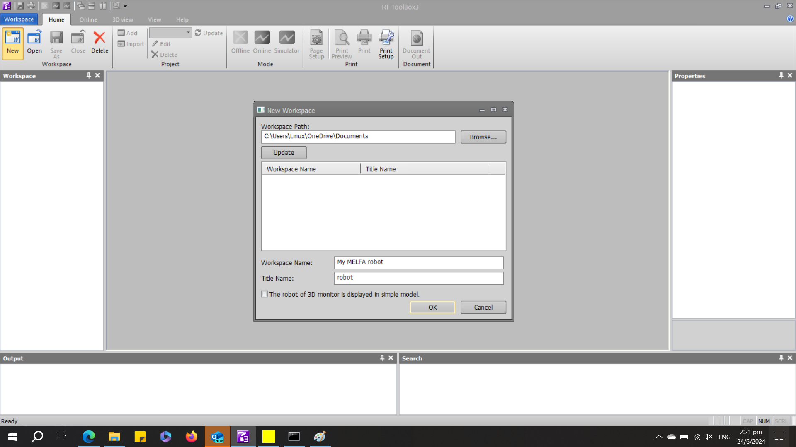
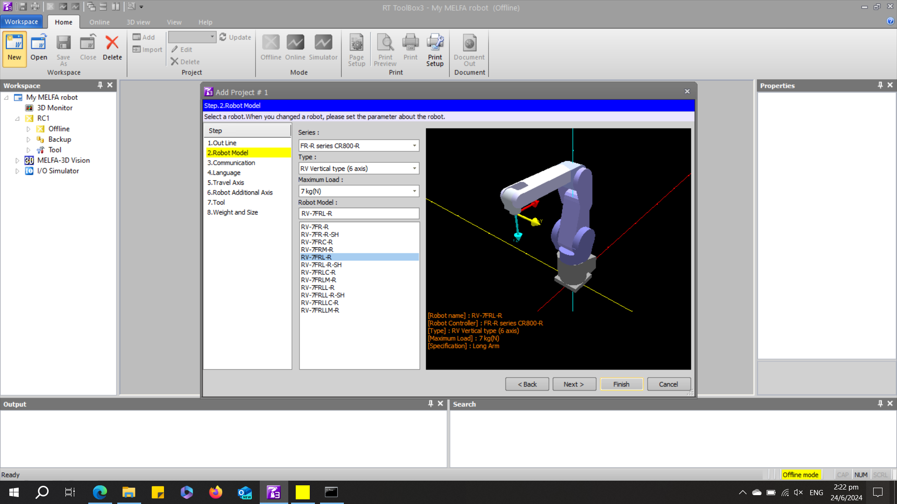
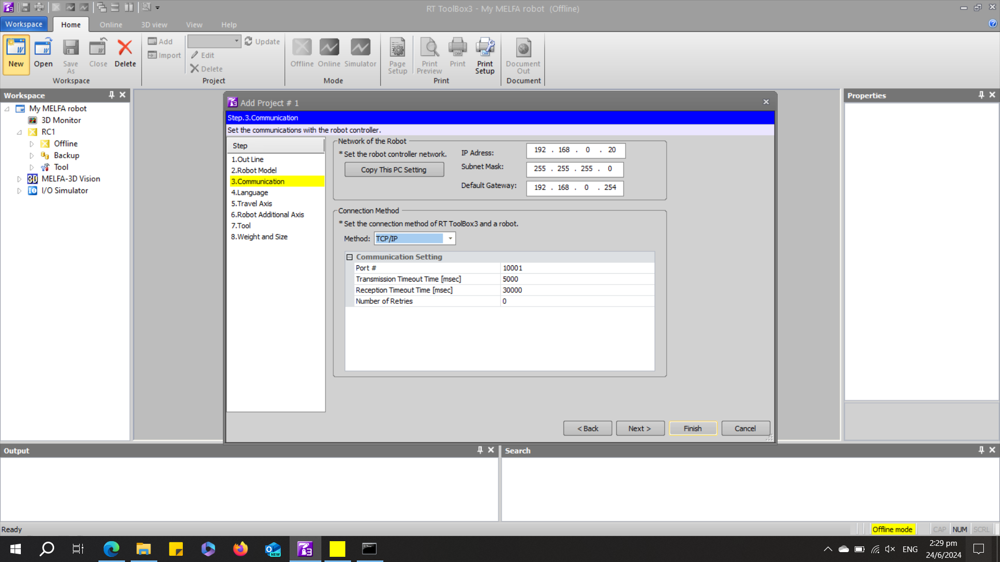
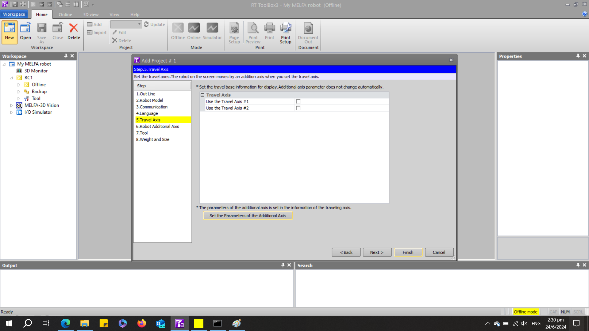
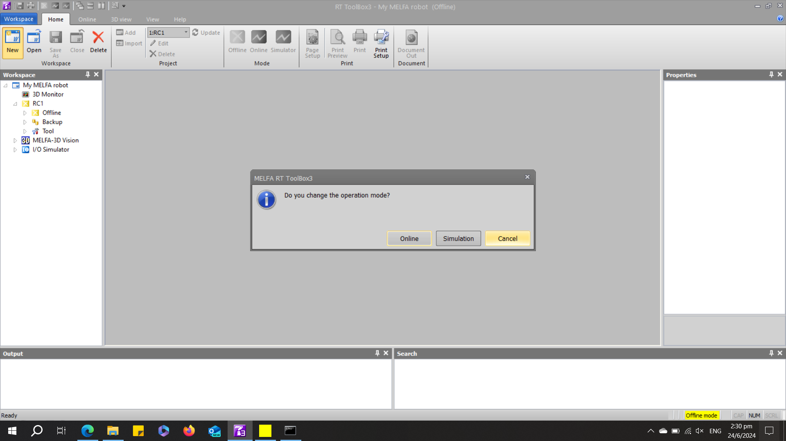
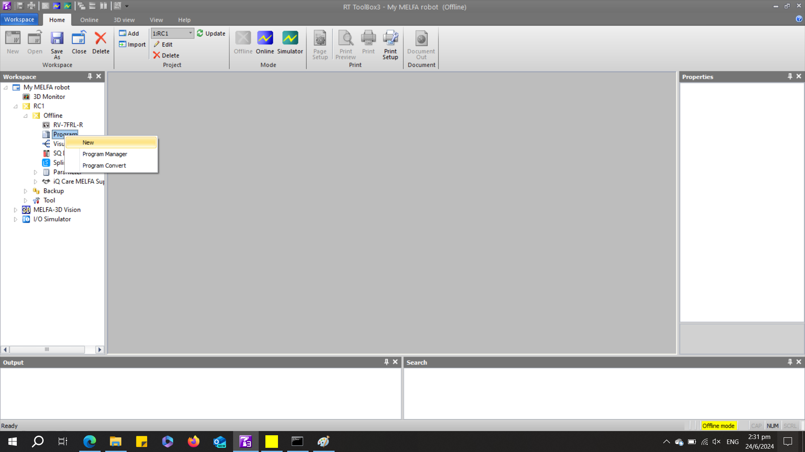
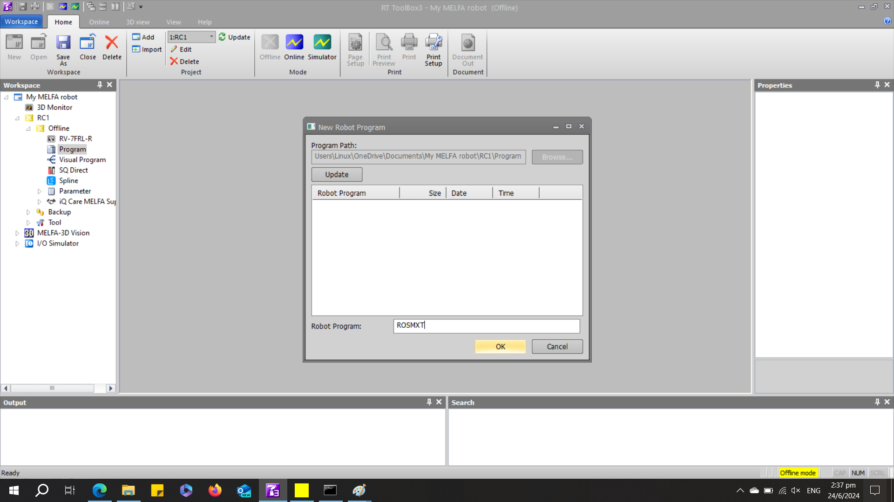
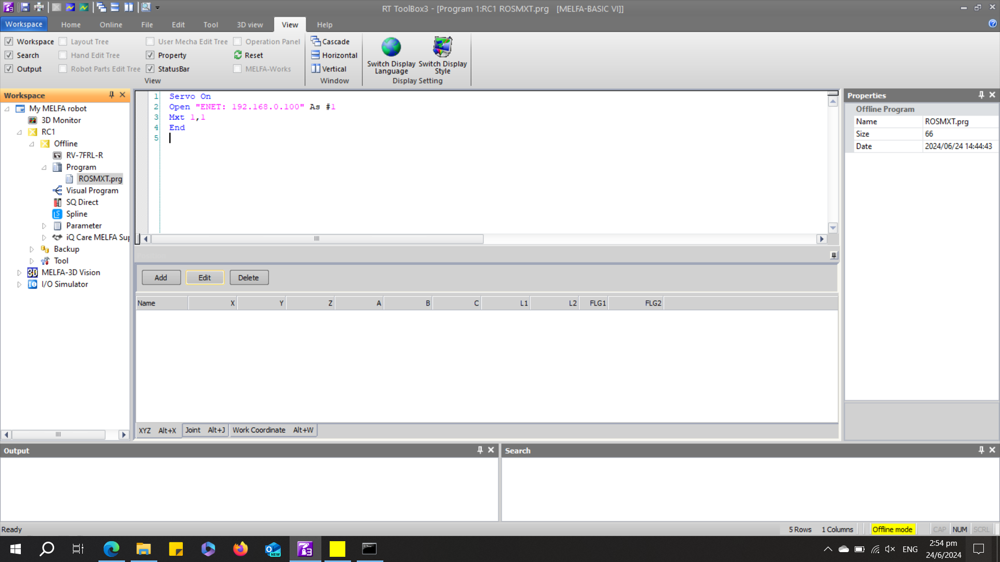

 

# __RT Toolbox3 Setup__

The complete RT Toolbox3 manual can be downloaded at [RT ToolBox3/RT ToolBox3 mini User's Manual](https://dl.mitsubishielectric.co.jp/dl/fa/document/empf/manual/robot/bfp-a3495/bfpa3495s.empf) from [Robot Industrial/Collaborative Robot MELFA Manual](https://www.mitsubishielectric.co.jp/fa/download/search.do?mode=manual&kisyu=/robot). MELFA ROS2 Driver is developed using the __Real Time External Control__ function. For more information, refer to [Ethernet Function Instruction Manual](https://dl.mitsubishielectric.co.jp/dl/fa/document/empf/manual/robot/bfp-a3379/bfpa3379g.empf) from [Robot Industrial/Collaborative Robot MELFA Manual](https://www.mitsubishielectric.co.jp/fa/download/search.do?mode=manual&kisyu=/robot)This chapter will cover the basics of project file creation, setting up a robot in simulation and connecting to a physical robot in the context of operating MELFA ROS2.

If you have completed this guide, please take a look at [real robot setup](./rt_real_setup.md) or [RT Toolbox3 simulator setup](./rt_sim_setup.md). 

Sections:
1. __Project File Setup__
2. __Program Creation__

## __1. Project File Setup__

This section will guide you on creating an RT Toolbox3 project file in the context of ROS2.


 1. Create a _project file_ by selecting __New__, and give your workspace a name and a title, as shown below.

<br/>

   


<br/>

 2. Select __Robot Model__ from the popup window and select your robot. For this tutorial, RV-7FRL-R will be used. 

<br/>

   


<br/>

 3. Select __Communication__ and select your prefered robot connection method.

 - For CRnQ_R USB connection, it is recommended to use a USB cable with a ferrite core such as  [GT09-C30USB-5P](https://mitsubishi-electric-eshop.mee.com/mee/FA_IA/en/EUR/Catalogue/HMI/Cable/GT09-C30USB-5P/p/000000000000166373)
<br/>

  


<br/>

 - For TCP/IP connection, it is recommended to use a CAT5e or above ethernet cable, for detailed instructions, for communicating with the robot via TCP/IP, refer to [Ethernet Function Instruction Manual](https://dl.mitsubishielectric.co.jp/dl/fa/document/empf/manual/robot/bfp-a3379/bfpa3379g.empf) from [Robot Industrial/Collaborative Robot MELFA Manual](https://www.mitsubishielectric.co.jp/fa/download/search.do?mode=manual&kisyu=/robot)

  

 4. Select __Travel Axis__ to configure robot travel axis. For this tutorial, the travel axis will not be used. To learn more about setting up the travel axis, refer to [RT ToolBox3/RT ToolBox3 mini User's Manual](https://dl.mitsubishielectric.co.jp/dl/fa/document/empf/manual/robot/bfp-a3495/bfpa3495s.empf) from [Robot Industrial/Collaborative Robot MELFA Manual](https://www.mitsubishielectric.co.jp/fa/download/search.do?mode=manual&kisyu=/robot). 

 -  Select __Finish__.

<br/>




<br/>

 5. Select __Cancel__

<br/>




<br/>

## __2. Program Creation__

1.  Creating program for external control
 - Right-click __Program__ and select __New__.

<br/>



<br/>

2. Give your program a name. For this tutorial, it is named "ROSMXT".

<br/>




<br/>

 3. Copy and paste the following and replace "192.168.0.100" with your IP address of your ROS2 computer. The __MXT__ command takes three arguments; the third argument is the low pass filter in milliseconds. It is recommended to use a 10ms low pass filter. If the application requires slow motion, it is recommended to increase this value. __Ctrl__ + __S__ to save.
```
Servo On
Open "ENET: 192.168.0.100" As #1 'Insert your Linux Machine IP address in this line. Open stores the IP address into variable 1.
Mxt 1,1,10 'The first 1 refers to the IP address from the line above. 
           'The second 1 configures Mxt to expect Joint commands. 
           'The 10 refers to a 10ms low pass filter.
End 
```


<br/>



<br/>

### Your project file is ready!
You are ready to move on to a [real robot setup](./rt_real_setup.md) or a [RT Toolbox3 simulator setup](./rt_sim_setup.md)

### Other guides:
- [Home page](./../README.md)
- [MELFA ROS2 user guide](./melfa_ros2_driver.md) : Usage and Installation of MELFA ROS2.
- [RT Toolbox3 Setup](./rt_toolbox3_setup.md) : Create your first RT Toolbox3 Project File for ROS2.
- [RT Toolbox3 Simulator Setup](./rt_sim_setup.md) : Connect to RT Toolbox3 simulator as if it is a real robot.
- [RT Toolbox3 Real Robot Setup](./rt_real_setup.md): Connect to a MELFA robot.